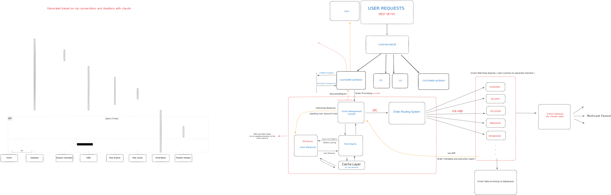

# System Overview

The exchange is built using a modular, low-latency architecture optimized for high-frequency and institutional trading. It is composed of several core subsystems, each designed to operate independently while maintaining efficient communication with others through a combination of IPC (inter-process communication) and UDP.

At a high level, the system flow begins when a user sends an order via the REST or FIX API. This request is routed through a Load Balancer to one of the Client Gateways (CG), which is responsible for validating and authentication the session, checking the API format, enforcing IP and rate limits, and converting protocols if needed. Once the request passes through the CG, it is forwarded to the Order Management System (OMS).

The OMS is the brain of the system — it performs real-time risk checks, verifies available balances, and routes the order to the appropriate Matching Engine. Matching Engines are deployed per trading pair and are optimized for ultra-low latency, stateless matching. Orders are transmitted via UDP to reduce network overhead.

After a match occurs, the resulting trade is acknowledged with an Execution Report sent back to the client. Post-trade tasks such as updating user balances and archiving order data are handled asynchronously to maintain fast response times.

> _The diagram below illustrates the overall system architecture and flow from user request to order execution._

## Key Components

- **Customer Gateway (CG)**: Performs request validation, rate limiting, protocol conversion.
- **Order Management System (OMS)**: Manages order lifecycle, risk checks, balance lookups.
- **Matching Engines**: Symbol-specific processors for order matching.
- **User Balance System**: Centralized and cached for fast risk computation.
- **Market Data System**: Real-time price feeds distributed via multicast.

This architecture ensures scalability, resilience, and microsecond-level latency across the entire order lifecycle.
