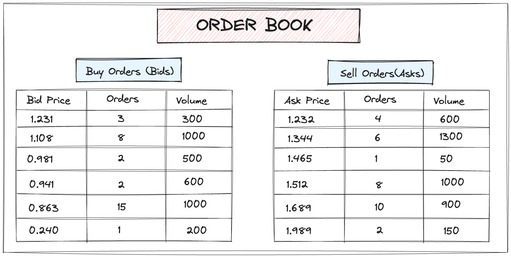
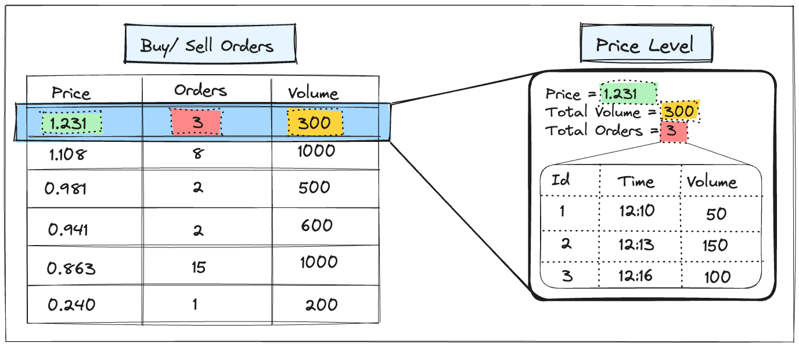
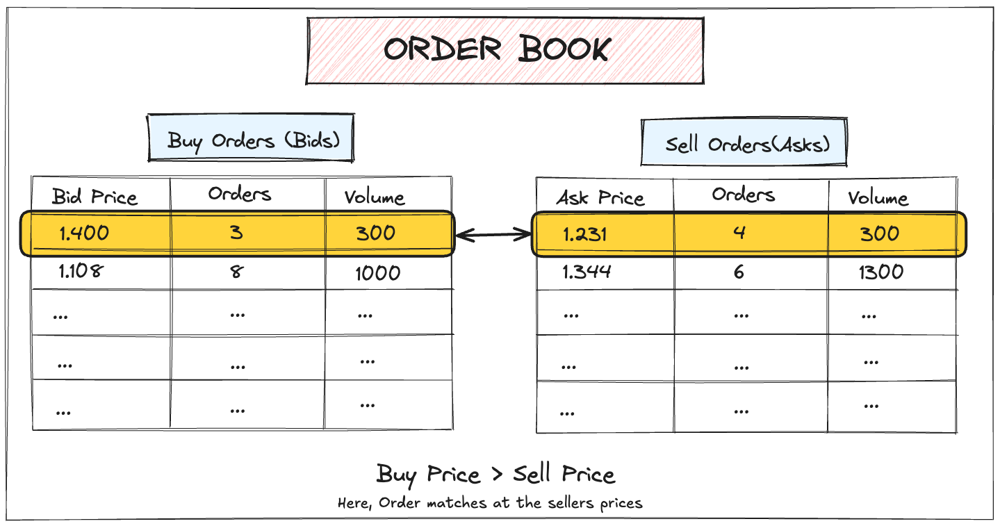

# Order Book

An order book is a core component of a financial exchange — it lists all buy and sell orders for a particular asset, organized by price. It enables price discovery, trade execution, and liquidity in a transparent and organized manner.

## Anatomy of an Order Book

> The diagram below dipicts two dynamic list one for buy order (bids) and other is for sell order (asks).

An order book contains two lists:

- **Bids**: Buy orders, sorted in descending order of price.
- **Asks**: Sell orders, sorted in ascending order of price.

This structure ensures that the highest bidding buyer and the lowest asking seller are prioritized.

## Order Types

- **Limit Order**: Buy/sell at a specific price.
- **Market Order**: Buy/sell immediately at the current available market price.

## Price Levels

> Price levels in the order book represent discrete prices at which orders are placed. Orders are typically managed in a FIFO (First-In-First-Out) manner, forming a queue.
> 

Each price level in the order book maintains:

- The price
- The total volume at that price
- A FIFO queue of individual orders at that price

## Priority Queue Behavior

Order books behave like priority queues:

- **Bids** → Max-heap (highest price on top)
- **Asks** → Min-heap (lowest price on top)

## Core Operations

- **Placement**: Insert a new order into the correct side.
- **Cancellation**: Remove an order before execution.
- **Modification**: Update price or quantity.
- **Execution**: Match orders and remove fulfilled ones.

## Matching Logic

### When Buy Price = Sell Price

- Trade is executed for the available quantity.
- Full or partial fill may occur depending on liquidity.

### When Buy Price > Sell Price

> If the buy price is higher then the sell price, than there will be transaction at the seller price.

- Trade occurs at the seller's price.
- Any leftover quantity becomes a resting order.

### When Buy Price < Sell Price

- No trade happens.
- This is known as “crossing the spread.”

Matching happens continuously and in real-time in modern exchanges to ensure liquidity and responsiveness.
