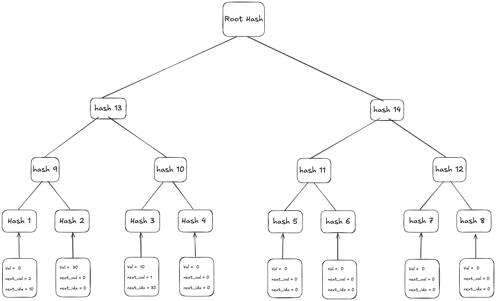

# Provable Order Book

CEXs requires user to trust their internal order matching as described in the previous section. But users can't verify if trades are matched fairly, if any manipulation occurred, or whether the system works as claimed. A provable order book introduces **cryptographic verifiablity**, making fairness auditable.

## Cryptographic Foundations

### Indexed Merkle Trees (IMTs)

In conventional systems, balanced trees (like AVL or red-black trees) are often used to maintain order books. While these are efficient in traditional computing environments, they are not well-suited for zk-SNARK circuits due to their rebalancing complexity and variable-depth structure.

**Indexed Merkle Trees (IMTs)** overcome these limitations by enabling fast and efficient verification of order data in a SNARK-friendly way. They combine the structure of Merkle Trees with a linked list-like navigation mechanism, making them ideal for dynamic datasets like order books.

For more information about Indexed Merkle Trees, [check out this blog](https://docs.aztec.network/aztec/concepts/advanced/storage/indexed_merkle_tree).

### Why IMTs?

IMTs are optimized for zero-knowledge applications due to their:

- **Fixed Depth**: Every path from leaf to root has the same length, which is crucial for static circuit design in SNARKs.
- **Efficient Membership/Non-Membership Proofs**: Easily prove whether an order exists (or doesn’t) in the book.
- **Linked List Semantics**: Each node carries forward pointers, allowing for efficient insertions without needing to rebalance the structure.
- **Minimal Circuit Complexity**: Avoids operations like rotations, making it arithmetization-friendly.



**Leaf Structure:**
```json
{
  "value": <order_price>,
  "next_index": <pointer_to_next_leaf>,
  "next_value": <next_order_price>
}
```

## VEX Provable Order Book

VEX introduces a zk-friendly, verifiable order book by leveraging IMTs. When a user places an order, instead of storing it in a traditional balanced tree, the system inserts it into an IMT. A proof of insertion is generated immediately, allowing third parties to verify that the order exists and is positioned correctly in the structure.

### Buy & Sell IMTs

To maintain separation and heap semantics:

- Buy Orders IMT: Structured as a max-heap, with the highest bid at the top. This allows the system to always identify the buyer willing to pay the most.
- Sell Orders IMT: Structured as a min-heap, with the lowest ask at the top. This helps prioritize the seller offering the lowest price.
- This dual-IMT system makes it efficient to identify matching opportunities and prove that trades are executed at fair market prices.

### Order Matching

Order matching is performed off-chain for performance and scalability. However, all matched trades are proven on-chain to ensure correctness and transparency.

1. The matching engine selects the best available buy and sell orders from the IMTs.
2. Before execution, the system generates cryptographic proofs:
    - That the selected buy order was the maximum (top) order in the Buy IMT.
    - That the selected sell order was the minimum (top) order in the Sell IMT.
3. These proofs are then submitted and verified on-chain, ensuring that the order matching occurred fairly and deterministically.

### Trade Execution & Proof Update

Once a match is verified:

1. The matched orders are either fully removed or partially filled and updated in the respective IMTs.
2. The IMTs are updated with the new state of the order book.
3. New validity proofs are generated for the updated trees, showing that the integrity and structure of the IMTs are maintained after the execution.

By using IMTs and zero-knowledge proofs, VEX enables a system where every trade is verifiable, ensuring fairness, transparency, and user trust — without compromising on performance.